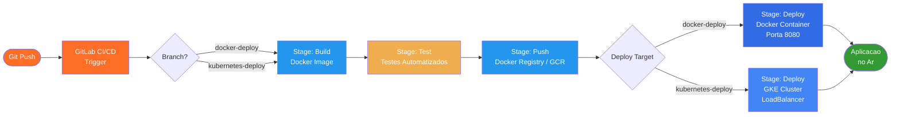
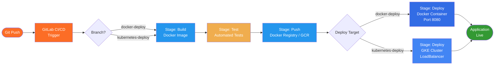

# Pipeline de Deploy com GitLab, Docker e Kubernetes

<p align="center">
  
  
  
  
  
  
</p>

---

> **[PT-BR]** Pipeline de deploy automatizado com GitLab CI/CD, Docker e Kubernetes (GKE).
> **[EN]** Automated deployment pipeline using GitLab CI/CD, Docker, and Kubernetes (GKE).

---

## Sumario / Table of Contents

- [Portugues (PT-BR)](#portugues-pt-br)
  - [Descricao do Projeto](#descricao-do-projeto)
  - [Arquitetura](#arquitetura)
  - [Diagrama do Pipeline](#diagrama-do-pipeline)
  - [Tecnologias Utilizadas](#tecnologias-utilizadas)
  - [Estrutura do Projeto](#estrutura-do-projeto)
  - [Pipeline CICD](#pipeline-cicd)
  - [Como Executar](#como-executar)
- [English (EN)](#english-en)
  - [Project Description](#project-description)
  - [Architecture](#architecture)
  - [Pipeline Diagram](#pipeline-diagram)
  - [Technologies Used](#technologies-used)
  - [Project Structure](#project-structure)
  - [CICD Pipeline](#cicd-pipeline)
  - [How to Run](#how-to-run)
- [License](#license)

---

## Portugues PT-BR

### Descricao do Projeto

Este projeto demonstra a criacao de um pipeline de deploy automatizado utilizando GitLab CI/CD, Docker e Kubernetes (GKE). O pipeline contempla dois cenarios:

1. **Deploy em Container Docker** - Aplicacao Node.js containerizada e executada em Docker
2. **Deploy em Cluster Kubernetes** - Aplicacao implantada em cluster Kubernetes na Google Cloud Platform (GCP)

O projeto foi desenvolvido como desafio do bootcamp **Microsoft Azure Advanced** da DIO, com foco em boas praticas de DevOps, automacao de entrega continua e orquestracao de containers em ambiente cloud.

---

### Arquitetura

```
GitLab Repository
    |
    |-- Branch: docker-deploy
    |       |
    |       +-- GitLab CI/CD --> Build Docker Image --> Push to Registry --> Deploy Container
    |
    +-- Branch: kubernetes-deploy
            |
            +-- GitLab CI/CD --> Build Docker Image --> Push to GCR --> Deploy to GKE Cluster
```

---

### Diagrama do Pipeline



---

### Tecnologias Utilizadas

| Tecnologia | Versao | Finalidade |
|---|---|---|
| GitLab CI/CD | Latest | Pipeline de integracao e entrega continua |
| Docker | 24+ | Containerizacao da aplicacao |
| Kubernetes (GKE) | 1.27+ | Orquestracao de containers em producao |
| Node.js | 18 LTS | Runtime da aplicacao |
| Google Cloud Platform | - | Infraestrutura cloud (GKE + GCR) |

---

### Estrutura do Projeto

```
gitlab-docker-kubernetes-pipeline/
├── app/
│   ├── server.js          # Aplicacao Node.js (servidor HTTP)
│   └── package.json       # Dependencias do projeto
├── docker/
│   └── Dockerfile         # Imagem Docker da aplicacao
├── kubernetes/
│   ├── deployment.yaml    # Deployment Kubernetes (replicas, imagem, recursos)
│   └── service.yaml       # Service LoadBalancer (exposicao externa)
├── .gitlab-ci.yml         # Pipeline CI/CD (stages: build, test, push, deploy)
└── README.md
```

---

### Pipeline CICD

O arquivo `.gitlab-ci.yml` define os seguintes estagios:

| Estagio | Descricao | Ferramenta |
|---|---|---|
| `build` | Construcao da imagem Docker a partir do Dockerfile | Docker |
| `test` | Execucao de testes automatizados da aplicacao | Node.js / Jest |
| `push` | Envio da imagem para o container registry (GitLab Registry ou GCR) | Docker / GCR |
| `deploy` | Deploy no ambiente alvo (Docker local ou GKE na nuvem) | kubectl / Docker CLI |

Cada branch aciona um fluxo de deploy distinto:

- **`docker-deploy`**: sobe o container Docker diretamente no servidor de CI/CD na porta 8080.
- **`kubernetes-deploy`**: realiza push da imagem para o Google Container Registry (GCR) e aplica os manifests Kubernetes no cluster GKE.

---

### Como Executar

#### Pre-requisitos

- Docker instalado (versao 24+)
- `kubectl` configurado e autenticado
- Acesso ao GCP com permissoes no GKE e GCR (para deploy em Kubernetes)
- Conta no GitLab com runner configurado
- `gcloud` CLI instalada e autenticada

#### Deploy Local com Docker

```bash
# Clonar o repositorio
git clone https://github.com/galafis/gitlab-docker-kubernetes-pipeline.git
cd gitlab-docker-kubernetes-pipeline

# Construir a imagem
cd app
docker build -t app-pipeline -f ../docker/Dockerfile .

# Executar o container
docker run -d -p 8080:8080 app-pipeline

# Verificar se esta rodando
curl http://localhost:8080
```

#### Deploy no Kubernetes (GKE)

```bash
# Autenticar no GCP
gcloud auth login
gcloud container clusters get-credentials SEU_CLUSTER --zone SEU_ZONE --project SEU_PROJETO

# Aplicar os manifests
kubectl apply -f kubernetes/deployment.yaml
kubectl apply -f kubernetes/service.yaml

# Verificar status
kubectl get pods
kubectl get services

# Obter o IP externo do LoadBalancer
kubectl get service app-service --watch
```

#### Configurar Variaveis no GitLab

Para o pipeline funcionar, configure as seguintes variaveis de ambiente no GitLab (Settings > CI/CD > Variables):

| Variavel | Descricao |
|---|---|
| `CI_REGISTRY_USER` | Usuario do container registry |
| `CI_REGISTRY_PASSWORD` | Senha do container registry |
| `GCP_SERVICE_KEY` | JSON da service account do GCP (base64) |
| `GCP_PROJECT_ID` | ID do projeto no Google Cloud |
| `GKE_CLUSTER_NAME` | Nome do cluster GKE |
| `GKE_CLUSTER_ZONE` | Zona do cluster GKE |

---

## English EN

### Project Description

This project demonstrates the creation of an automated deployment pipeline using GitLab CI/CD, Docker, and Kubernetes (GKE). The pipeline covers two deployment scenarios:

1. **Docker Container Deploy** - Node.js application containerized and deployed via Docker
2. **Kubernetes Cluster Deploy** - Application deployed to a Kubernetes cluster on Google Cloud Platform (GCP)

The project was developed as part of the **Microsoft Azure Advanced** bootcamp challenge on DIO, focusing on DevOps best practices, continuous delivery automation, and container orchestration in a cloud environment.

---

### Architecture

```
GitLab Repository
    |
    |-- Branch: docker-deploy
    |       |
    |       +-- GitLab CI/CD --> Build Docker Image --> Push to Registry --> Deploy Container
    |
    +-- Branch: kubernetes-deploy
            |
            +-- GitLab CI/CD --> Build Docker Image --> Push to GCR --> Deploy to GKE Cluster
```

---

### Pipeline Diagram



---

### Technologies Used

| Technology | Version | Purpose |
|---|---|---|
| GitLab CI/CD | Latest | Continuous integration and delivery pipeline |
| Docker | 24+ | Application containerization |
| Kubernetes (GKE) | 1.27+ | Container orchestration in production |
| Node.js | 18 LTS | Application runtime |
| Google Cloud Platform | - | Cloud infrastructure (GKE + GCR) |

---

### Project Structure

```
gitlab-docker-kubernetes-pipeline/
├── app/
│   ├── server.js          # Node.js application (HTTP server)
│   └── package.json       # Project dependencies
├── docker/
│   └── Dockerfile         # Docker image definition
├── kubernetes/
│   ├── deployment.yaml    # Kubernetes Deployment (replicas, image, resources)
│   └── service.yaml       # LoadBalancer Service (external exposure)
├── .gitlab-ci.yml         # CI/CD Pipeline (stages: build, test, push, deploy)
└── README.md
```

---

### CICD Pipeline

The `.gitlab-ci.yml` file defines the following stages:

| Stage | Description | Tool |
|---|---|---|
| `build` | Build the Docker image from the Dockerfile | Docker |
| `test` | Run automated application tests | Node.js / Jest |
| `push` | Push the image to the container registry (GitLab Registry or GCR) | Docker / GCR |
| `deploy` | Deploy to the target environment (local Docker or GKE in the cloud) | kubectl / Docker CLI |

Each branch triggers a distinct deployment flow:

- **`docker-deploy`**: runs the Docker container directly on the CI/CD server on port 8080.
- **`kubernetes-deploy`**: pushes the image to Google Container Registry (GCR) and applies the Kubernetes manifests to the GKE cluster.

---

### How to Run

#### Prerequisites

- Docker installed (version 24+)
- `kubectl` configured and authenticated
- GCP access with GKE and GCR permissions (for Kubernetes deployment)
- GitLab account with a configured runner
- `gcloud` CLI installed and authenticated

#### Local Deploy with Docker

```bash
# Clone the repository
git clone https://github.com/galafis/gitlab-docker-kubernetes-pipeline.git
cd gitlab-docker-kubernetes-pipeline

# Build the image
cd app
docker build -t app-pipeline -f ../docker/Dockerfile .

# Run the container
docker run -d -p 8080:8080 app-pipeline

# Verify it is running
curl http://localhost:8080
```

#### Deploy to Kubernetes (GKE)

```bash
# Authenticate with GCP
gcloud auth login
gcloud container clusters get-credentials YOUR_CLUSTER --zone YOUR_ZONE --project YOUR_PROJECT

# Apply the manifests
kubectl apply -f kubernetes/deployment.yaml
kubectl apply -f kubernetes/service.yaml

# Check status
kubectl get pods
kubectl get services

# Get the external LoadBalancer IP
kubectl get service app-service --watch
```

#### Configure GitLab Variables

For the pipeline to work, set the following environment variables in GitLab (Settings > CI/CD > Variables):

| Variable | Description |
|---|---|
| `CI_REGISTRY_USER` | Container registry username |
| `CI_REGISTRY_PASSWORD` | Container registry password |
| `GCP_SERVICE_KEY` | GCP service account JSON (base64 encoded) |
| `GCP_PROJECT_ID` | Google Cloud project ID |
| `GKE_CLUSTER_NAME` | GKE cluster name |
| `GKE_CLUSTER_ZONE` | GKE cluster zone |

---

## License

MIT License - see [LICENSE](LICENSE) for details.

Copyright (c) 2024 Gabriel Demetrios Lafis

Permission is hereby granted, free of charge, to any person obtaining a copy of this software and associated documentation files (the "Software"), to deal in the Software without restriction, including without limitation the rights to use, copy, modify, merge, publish, distribute, sublicense, and/or sell copies of the Software, and to permit persons to whom the Software is furnished to do so, subject to the following conditions:

The above copyright notice and this permission notice shall be included in all copies or substantial portions of the Software.

THE SOFTWARE IS PROVIDED "AS IS", WITHOUT WARRANTY OF ANY KIND, EXPRESS OR IMPLIED, INCLUDING BUT NOT LIMITED TO THE WARRANTIES OF MERCHANTABILITY, FITNESS FOR A PARTICULAR PURPOSE AND NONINFRINGEMENT. IN NO EVENT SHALL THE AUTHORS OR COPYRIGHT HOLDERS BE LIABLE FOR ANY CLAIM, DAMAGES OR OTHER LIABILITY, WHETHER IN AN ACTION OF CONTRACT, TORT OR OTHERWISE, ARISING FROM, OUT OF OR IN CONNECTION WITH THE SOFTWARE OR THE USE OR OTHER DEALINGS IN THE SOFTWARE.
